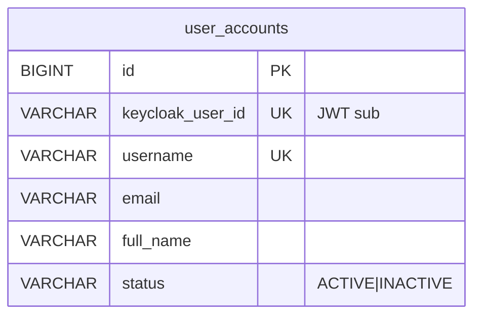

# ERD

> Status: **ĐANG ĐIỀN** — cập nhật cùng thay đổi với migration. Chi tiết cột: `DATA_DICTIONARY.md`. Mô hình khái niệm đầy đủ: `docs/business/DOMAIN_MODEL.md`.

## identity-access

```mermaid
erDiagram
    user_accounts {
        BIGINT id PK
        VARCHAR keycloak_user_id UK "JWT sub"
        VARCHAR username UK
        VARCHAR email
        VARCHAR full_name
        VARCHAR status "ACTIVE|INACTIVE"
    }
```
